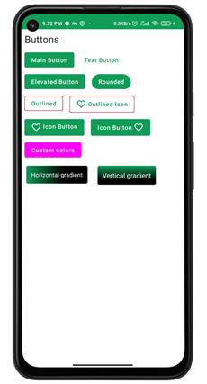
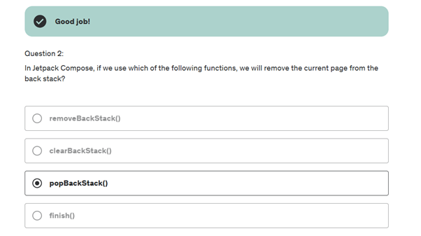
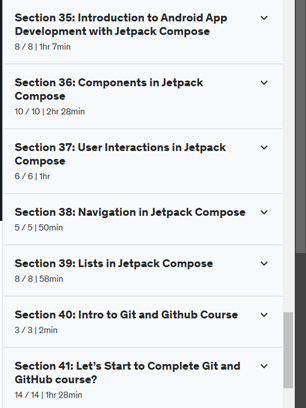

# Лабораторна робота №7
## Програмування для мобільних пристроїв
### Харківський національний економічний університет ім. С.Кузнеця

**Виконала**: Бабачанах К.С., студентка 4 курсу групи 6.04.122.010.21.2, факультету ІТ

---

## Вступ

Цей репозиторій містить усі виконані роботи та проекти.

---

## Огляд розділів

### Section 35: Introduction to Android App Development with Jetpack Compose

Секція 35 курсу присвячена вивченню Jetpack Compose — новітньої бібліотеки для створення користувацьких інтерфейсів на Android. Ось основні аспекти та теорія, які я вивчила:

1. **Jetpack Compose** - це сучасний інструментарій для побудови декларативного UI на Android, що дозволяє розробникам використовувати Kotlin для більш інтуїтивного і простішого процесу створення інтерфейсів, порівняно з традиційним підходом через XML.
2. **Android Studio** - головне середовище розробки, яке надає широкий спектр інструментів для ефективної роботи з кодом, відладки та тестування додатків.
3. **Android Virtual Device (AVD)** - віртуальний пристрій, який емулює реальні пристрої Android для тестування додатків без необхідності використання фізичного пристрою.
4. **Gradle** - система автоматичної збірки, яка управляє залежностями, версіями та іншими аспектами проекту, спрощуючи процес розробки та впровадження змін.
5. **Файл Manifest** - центральний конфігураційний файл, який визначає основні компоненти додатку, його доступ до системних функцій і вимоги до дозволів.
6. **Ресурси** - важливі компоненти Android-додатків, такі як зображення, строки, макети та стилі, які використовуються для створення гнучких та адаптивних користувацьких інтерфейсів. 

- **XML Manifest файл**

- **Бібліотеки які використовує gradle**

- **XML Manifest файл**
  

- **Папка з ресурсами**
  

- **У кінці секції 35 я пройшла тест**
  

---

### Section 36: Components in Jetpack Compose

Секція присвячена вивченню основних компонентів у Jetpack Compose, які використовуються для створення інтерфейсів Android додатків. Ось детальний огляд навчальних матеріалів:

1.	**Layouts in Android Jetpack Compose (Column, Row, Box)** - ці компоненти допомагають організувати вміст на екрані. Column використовується для вертикального розміщення елементів, Row - для горизонтального, а Box - для нашарування одного елемента на інший.

2.	**Arrangements and Alignments** - налаштування положення компонентів у макетах. Arrangements визначає, як компоненти розподіляються всередині рядків або стовпців, наприклад, з простором між елементами або без. Alignments дозволяє вирівняти компоненти відносно їх контейнерів.
  

3.	**Buttons** - один з основних елементів управління в будь-якому додатку, що дозволяє користувачам взаємодіяти з додатком
     

4.	**TextField** - використовуються для вводу тексту користувачем. У Jetpack Compose можна легко налаштовувати різні аспекти текстових полів, такі як валідатори вводу або стилізація.
     

5.	**CheckBox** - дають змогу користувачам вибирати декілька опцій зі списку.
     

6.	**Radio Buttons** - використовуються для вибору однієї опції з кількох доступних.
     

7.	**Switch** - елемент управління, що використовується для перемикання між двома станами (увімкнено/вимкнено).
     

8.	**Dropdown Menu** - дозволяє користувачам вибирати один з багатьох варіантів у компактному інтерфейсі.
     

- **Quiz 36**
  

---

### Section 37: User Interactions in Jetpack Compose

У цій секції я навчилась створювати Toast, Snackbar and Dialog Messages.

- **Toast Messages in Android App Development**

- **Snackbar Messages in Android App Development**
  

- **Dialog Messages**
  

- **Quiz 37**
  

---

### Section 38: Navigation in Jetpack Compose

У секції 38 курсу розглядається навігація в додатках Android за допомогою Jetpack Compose, де основний акцент робиться на використанні компонента навігації для створення багатосторінкових додатків з декларативним підходом. Вивчається створення нових сторінок у проекті та методи передачі даних, таких як ім'я та вік, між різними екранами додатку. Практичні приклади в Android Studio допомагають краще зрозуміти, як налаштовувати навігаційну структуру за допомогою NavHost та NavController для ефективного управління переходами між компонентами.

- **Modular Navigation with Jetpack Compose**

- **Quiz 38**
  

---

### Section 39: Lists in Jetpack Compose

В секції 39 курсу розглядається робота зі списками в Jetpack Compose. Для представлення даних у вигляді списків використовуються такі структури, як LazyColumn, LazyRow, та LazyGrid. Ці компоненти дозволяють ефективно відображати великі набори даних, що можуть прокручуватися за допомогою "ледачої" загрузки, забезпечуючи високу продуктивність інтерфейсу:

- LazyColumn використовується для вертикальних списків.
- LazyRow застосовується для горизонтальних списків.
- LazyGrid пропонує сітку для організації елементів у кілька рядків або стовпців.
  
Компонент Card використовується для стилізації окремих елементів списку, дозволяючи налаштувати вигляд, відстані між елементами та анімації для взаємодій, таких як натискання. Завдяки цьому, розробники можуть створювати високоадаптивні та атрактивні мобільні додатки, що використовують списки для відображення даних.

- **Quiz 39**
  

---

### Section 40: Intro to Git and Github Course

Секція 40 курсу знайомить із основами роботи з Git та GitHub. У ній розглядаються три основні аспекти: перше відео дає загальне уявлення про те, що можна вивчити з курсу та як звертатися по допомогу при роботі з Git та GitHub. Друге відео зосереджено на тому, як організувати файли проектів та документацію курсу в репозиторіях на GitHub, що важливо для ефективного управління версіями і співпраці. Третє відео містить відповіді на часті питання, пов'язані з використанням Git і GitHub, а також іншими платформами, такими як Bitbucket і можливостями автоматизації за допомогою Git Actions, допомагаючи зрозуміти як оптимізувати робочі процеси.

---

### Section 41: Let's Start to Complete Git and GitHub course?

У розділі 41 курсу про Git та GitHub розглядаються ключові аспекти роботи з Git, починаючи з базових концепцій до більш складних операцій. Розділ починається з огляду того, що таке Git і чому ми його використовуємо, пояснюючи його важливість для управління версіями коду. Далі йдуть відео про встановлення Git та GitHub.

Навчальний курс також включає в себе відео про створення репозиторію в Git та GitHub, а також про додавання і вилучення файлів зі стейджу. Це дає змогу зрозуміти, як підготувати зміни до фіксації.

Окрему увагу приділено операціям з гілками, включно з їх створенням, злиттям та вирішенням конфліктів. Це критично важливі навички для роботи в команді та управління складними проектами.

- **Quiz 41**
  

---

## Заключення

Цей курс забезпечив глибоке знайомство з розробкою мобільних додатків на платформі Android, зосереджуючись на практичному застосуванні теоретичних знань.

---

### Усі секції пройдені

